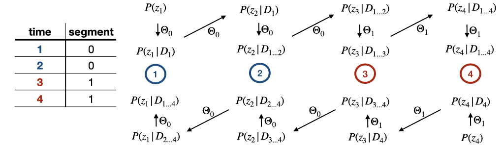

# RealTrace

__Version: 0.4.3__

---
## Table of Contents
- [RealTrace](#realtrace)
  - [Table of Contents](#table-of-contents)
  - [1 Compile](#1-compile)
    - [1.1 Compile locally](#11-compile-locally)
    - [1.2 Compile on cluster](#12-compile-on-cluster)
  - [2 Run](#2-run)
    - [2.1 Required arguments](#21-required-arguments)
      - [2.1.1 Input file](#211-input-file)
      - [2.1.2 Parameter file](#212-parameter-file)
    - [2.2 Using segments](#22-using-segments)
    - [2.2.3 Optional arguments](#223-optional-arguments)
      - [2.3.1 Csv\_config file](#231-csv_config-file)
  - [3 Model parameters](#3-model-parameters)
  - [4 Output](#4-output)
  - [5 Running modes](#5-running-modes)
    - [5.1 maximize](#51-maximize)
    - [5.2 predict](#52-predict)
    - [5.3 joints](#53-joints)
    - [5.4 scan (debugging only)](#54-scan-debugging-only)
  - [6 Error messages](#6-error-messages)
  - [Version](#version)
    - [Changed in 0.2.0](#changed-in-020)
    - [Changed in 0.3.0](#changed-in-030)
    - [Changes in 0.4.0](#changes-in-040)
    - [Changes in 0.4.1](#changes-in-041)
    - [Changes in 0.4.2](#changes-in-042)
    - [Changes in 0.4.3](#changes-in-043)
  - [TODO](#todo)

---

## 1 Compile
### 1.1 Compile locally
The following two libraries are needed:
- nlopt (for minimization)
  - see [nlopt documentation](https://nlopt.readthedocs.io/en/latest/#download-and-installation) for installation details
- Eigen (for linear algebra)
  - see [Eigen documentation](http://eigen.tuxfamily.org/index.php?title=Main_Page) for installation details
  
Make sure the correct paths to the two libraries are set in the `Makefile`. Currently, both are assumed to be located in the home directory. Then, compile with:

`cd src; make local`

### 1.2 Compile on cluster
1. Install nlopt
- Will install nlopt in the home directory with static linking. You can change that via `DCMAKE_INSTALL_PREFIX`, but make sure to adjust the makefile accordingly!
```
ml purge
ml GCC/8.3.0
ml Eigen/3.3.7
ml CMake/3.15.3-GCCcore-8.3.0
wget https://github.com/stevengj/nlopt/archive/v2.7.1.tar.gz
tar -xf v2.7.1.tar.gz 
cd nlopt-2.7.1/
cmake -DCMAKE_INSTALL_PREFIX=~/nlopt -DBUILD_SHARED_LIBS=OFF .
make
make install
```
2. Compile 
- Clone this repository and navigate to the `src` directory within the repository
- Run `make cluster`. This will run `ml GCC/8.3.0; ml Eigen/3.3.7` as well as the compile command! Note, that the modules remain loaded after compilation.


## 2 Run
`cd bin`
`./RealTrace [-options]` with the following options:
```
-h, --help                         this help message
-i, --infile                       (required) input data file
-b, --parameter_bounds             (required) file(s) setting the type, step, bounds of the parameters
-c, --csv_config                   file that sets the columns that will be used from the input file
-l, --print_level                  print level {0,1,2}, default: 0
-o, --outdir                       specify output direction and do not use default
-t, --tolerance_maximization       absolute tolerance of maximization between optimization steps, default: 1e-10
-r, --rel_tolerance_joints         relative tolerance of joint calculation: default 1e-10
-space, --search_space             search parameter space in {'log'|'linear'} space, default: 'log'
-noise, --noise_model              measurement noise of fp content {'const'|'scaled'} default: 'const'
-div, --cell_division              cell divison model {'gauss'|'binomial'} default: 'gauss'
-m, --maximize                     run maximization
-s, --scan                         run 1d parameter scan
-p, --predict                      run prediction
-j, --joints                       run calculation of joint probabilities
```
Example: `./RealTrace -c csv_config.txt -b parameters.txt -i data/example.csv -o out/ -l 1 -t 1e-10 -m -p`

### 2.1 Required arguments
- `infile` sets the input file that contains the data, eg as given by MOMA (see 2.1.1)
- `parameter_bounds` sets the file that defines the parameter space (see 2.1.2)

#### 2.1.1 Input file
The input file is assumed to fulfill the following:
- the data points of a cell appear as consecutive rows and are in the correct order with respect to time.
- The data set has to include all columns that are set via the `csv_config` file, i.e. `time_col`, `length_col`, `fp_col`.
- The cells can be uniquely identified via the tags provided via `parent_tags` and `cell_tags` and each mother cell has at most 2 daughter cells. If that is not the case, the `parent_tags` and `cell_tags` are not sufficient and a warning will be printed.
- In order to estimate the initial covariance matrix, the data set needs to contain at least (!) 2 cells.
- An optional column may be added for the usage of segments, see below for more information.


#### 2.1.2 Parameter file
How the different parameters are treated during the likelihood maximization is defined by the following syntax:
- free_parameter = init, step
- bound_parameter = init, step, lower, upper
- fixed_parameter = init
  
An example file can look like this:
```
mean_lambda = 0.01, 1e-3
gamma_lambda = 0.01, 1e-3, 1e-4, 0.05
var_lambda = 1e-07

mean_q = 10, 1e-1
gamma_q = 0.01, 1e-3, 1e-4, 0.05
var_q = 1, 1e-2

beta = 5e-2

var_x = 1e-3, 1e-5
var_g = 1, 1e-3

var_dx = 1e-4, 1e-5
var_dg = 1, 1e-2
```
ALL parameters are restricted to positive numbers by default avoiding unphysical/meaningless parameter ranges. By setting the lower bound in the parameter file, one can overwrite the lower bounds of the parameters. 

During the maximization, the s will be the initial step size. From nlopt doc: 
"For derivative-free local-optimization algorithms, the optimizer must somehow decide on some initial step size to perturb x by when it begins the optimization. This step size should be big enough that the value of the objective changes significantly, but not too big if you want to find the local optimum nearest to x."

### 2.2 Using segments
To analyze data sets that contain data points that shall be fitted by a different set of underlying parameters, segment indices can be used. For that, a `segment_col` in the `csv_config` file can be specified. This column should contain the _segment index_ specifying for each data point to which segment it belongs. The segment indices are required to be consecutive and start at index 0. 

The likelihood maximization that determines the parameter estimates is run independently for each segment. That means there is no difference between running different segments in separate runs or as part of the same data set. The same behavior is used for 1d scans. However, the predictions as well as the calculation of the joint probabilities that are used for the correlation functions are calculated by iterating through the entire data set. For that, the following scheme is used

Where each step involves two calculations: the calculation of the new prior which depends on the parameters of the biophysical model and the calculation of the posterior which depends on the parameters of the measurement noise. Note, that the prior calculation to go from time points 2 to 3 and vice versa both take the parameters of the 0th segment.

For each segment in the data set one parameter file is required submitted in the order of the segment indices. For example:
```
./RealTrace -b parametersA.txt parametersB.txt ... 
```
will use the parameters in the file `parametersA.txt` for the segment with index 0 and the parameters in the file `parametersB.txt` for the segment with index 1, etc...

### 2.2.3 Optional arguments
- `csv_config` sets the file that contains information on which columns will be used from the input file (see 2.3.1)
- `print_level (0)` set to 0 suppresses input of the likelihood calculation, `1` prints every step of the maximization/scan/error bar calculation. This is purely meant for debugging!
- `tolerance_maximization (1e-3)` sets the stopping criterion by setting the tolerance of maximization: Stop when an optimization step changes the function value by less than tolerance. By setting very low tolerances one might encounter rounding issues, in that case, the last valid step is taken and a warning is printed to stderr.
- `rel_tolerance_joints (1e-12)` sets the stopping criterium for the joint calculation. The calculation is stopped when the cross covariances between the two time points are smaller than the product of the corresponding means times the set tolerance. $\frac{\text{Cov}(z_{n+m}, z_n)_{i,j}}{ \langle z_{n+m}\rangle_i \langle z_n\rangle_j} < \text{tolerance }$
- `outdir` overwrites the default output directory, which is (given the infile `dir/example.csv/`) `dir/example_out/`
- `search_space (log)` sets the search space of the parameters to be either in log space or linear space. The parameter file does not need to be changed as everything is done internally. 
- `noise_model (scaled)` defines how the measurement noise depends on the content of fluorescence proteins. `const` means that the measurement is constant with a variance `var_g`. `scaled` means the variance of the measurement scales linearly with the fluorescence protein content. In this case `var_g` is the prefactor of the scaling. 
- `cell_division (binomial)` defines the model for cell division. `binomial` splits the FP content according to the cell sizes of the daughter cells and binomial sampling. In this case, the parameter `var_dg` is the conversion factor between the FP input and the physical number of independent molecules that can be distributed across cells. `gauss` refers to a model where the FP contents of the daughter cells are drawn from a gaussian with variance `var_dg` centered around half of the mother cell FP content

#### 2.3.1 Csv_config file
```
time_col = time_min
rescale_time = 60
length_col = length_um
fp_col = GFP
```
The following settings define how the input file will be interpreted.
- `time_col (time)`: column from which the time is read
- `rescale_time (1)`: the factor by which time will be divided before anything is run
- `length_col (length)`: column from which the length of the cell is read
- `length_islog (false)`: indicates if the cell length in the data file is in logscale (true) or not (false)
- `fp_col (gfp)`: column from which the fluorescence protein content is read
- `delm (,)`: delimiter between columns, probably ',' or ';'
- `segment_col ()`: column from which the segment index is read. Not setting `segment_col` in the file indicates that segment indices will not be used 
- `filter_col ()`: column from which the filter will be read. To include a data point, set the entry in this column to `True`, `true`, `TRUE` or `1` and to EXclude a data point, set the entry in this column to `False`, `false`, `FALSE` or `0`. Not setting `filter_col` in the file indicates that the input file will not be filtered
- `cell_tag (cell_id)`: columns that will make up the unique cell id, endings like .0 .00, etc of numeric values will be removed
- `parent_tags (parent_id)`: columns that will make up the unique cell id of the parent cell, endings like .0 .00, etc of numeric values will be removed


## 3 Model parameters
The 2 OU processes are described with a mean value (thus the mean growth/production rate), a gamma parameter determining how fast the process is driven towards its mean after a deviation, and a characteristic kick size that scales the noise term. Thus we have the following parameters:
- Growth rate fluctuations params:
    - mean_lambda
    - gamma_lambda  
    - var_lambda     
- GFP fluctuation params:
    - mean_q    
    - gamma_q    
    - var_q  
- Bleaching rate
    - beta    
- cell division:
    - var_dx 
    - var_dg     
- Measurement noise:
    - var_x     
    - var_g  

## 4 Output
The following run modes can be set:
-m, --maximize 
-s, --scan 
-p, --predict
-j, --joints
The respective output is explained below.

All files that are generated in the maximization and the prediction step are named as follows: `example_f<free>_b<bounds>` and where `<free>` lists the variable via the index as e.g. printed when the code is run and `<bounds>` lists the bound parameters in the same way. Example: `example_f034_b129`. Then, the ending of the different files indicates what they contain. 

Each file generated starts with a table with the parameter settings that were used to enable reproducibility:
- The first line is a header for the parameter table 
 and the following 11 lines contain the parameter setting and potentially the final estimates from the optimization if available. The prediction files and the auto_correlation file append the parameter settings of the other segments one after another if multiple segments are present.
- The following line is empty

## 5 Running modes
### 5.1 maximize
Maximizes the likelihood function and in this way estimates the parameters of the model.

__Output:__
- Will create 3 files: one for the maximization process (`_interations.csv`), one for the final estimations (`_final.csv`), and a "parameter file" (`_parameter_file.txt`) that can directly be used as an input for a prediction run (this file is formatted like the input parameter file and does not contain the table contain the parameter settings)
- The _interations_ file contains all likelihood evaluations of the likelihood maximization
- The _final_ file contains the estimated error for the estimated parameters via a Hessian matrix. The Hessian is calculated using a range of finite differences that are set relative to the value of the respective parameter. I.e. epsilon=1e-2 corresponds to 1% of each parameter used for the Hessian matrix estimation. Finally, the number of data points, the total log-likelihood, the normalized log-likelihood, the used optimization algorithm, the set tolerance, and the search space (log/linear) are noted.
- The _parameter_ file is in the format of the parameter file that was submitted to the code (see Sec. 2.1.2). It only contains the final estimation of each parameter. Thus, the parameters are treated as "fixed", when the code is run with this parameter file. This file can be used to run the prediction step directly (potentially on a different input file).
- As the maximization is run on the different segments independently, `_segment` followed by the segment index is added to the sample input file name in case there are multiple segments. 


### 5.2 predict
In case the maximization is also run, the final parameter estimate is used for the prediction, otherwise, the init value of each parameter is used.

__Output:__
- Will create 3 files: combined predictions (`_prediction.csv`), backward only (`_prediction_backward.csv`), and forward only (`_prediction_forward.csv`)
- The predictions consist of:
  - the 4 mean quantities of `x`, `g`, `l` (refers to lambda), and `q` 
  - the upper triangle of the covariance matrix labeled `cov_zi_zj` where `zi` and `zj` are one of `x`, `g`, `l`, and `q`.
  - ... of each time point for each cell in the same order as the input file

### 5.3 joints
Runs the calculation of the joint probabilities of pairs of data points. The 2-point probabilities are needed to calculate correlation functions.

Running the calculation of the joint distributions also runs the prediction part and generates those files. Setting both flags is therefore redundant but also not harmful.

The number of joints $P(z_{n+m}, z_n)$ that are calculated for each $z_n$ is determined by the `rel_tolerance_joints` that is set (see 2.2.3).  

__Output:__
- Will create a file named `_joints.csv` containing all calculated joints formatted as an upper triangle matrix. Rows correspond to the earlier time point in the joint, while columns correspond to the later time point named `celllid_time`, where `cellid` corresponds to whatever is defined as the cellid and time is time 
  

| cell_id | parent_id | time | cell1_0 | cell1_1 | cell1_2 | cell1_3 | cell2_4 | cell2_5
|---------|-----------|------|---------|---------|---------|---------|---------| --------|
| cell1 |       | 0 |  |P(z_1, z_0)    | P(z_2, z_0)   | P(z_3, z_0) | P(z_4, z_0)  |P(z_5, z_0) |
| cell1 |       | 1 |  |               | P(z_2, z_1)   | P(z_3, z_1) | P(z_4, z_1)  |P(z_5, z_1) |
| cell1 |       | 2 |  |               |               | P(z_3, z_2) | P(z_4, z_2)  |P(z_5, z_2) |
| cell2 | cell1 | 3 |  |               |               |             | P(z_4, z_3)  |P(z_5, z_3) |
| cell2 | cell1 | 4 |  |               |               |             |              |P(z_5, z_4) |


- Each joint probability consists of its means and the upper triangle of its covariance matrix and thus of 8+36=44 values in total.


### 5.4 scan (debugging only)
The 1d parameter scans will calculate the likelihood for the 1d ranges set by the parameter_bound file. Note, that only "bound" parameters will be scanned.

__Output:__
- Will create a file for each parameter containing all calculated likelihoods of the scan
- As the scans are run on the different segments independently, `_segment` followed by the segment index is added to the sample input file name in case there are multiple segments. 
  

## 6 Error messages
The code has a number of errors that might be thrown at runtime. Some of them are listed below. In particular, the errors that occur during command line parsing (arg_parser) are not listed here. 
- _(sc_likelihood) ERROR: Log-likelihood calculation failed: Log-likelihood is Nan_: The likelihood of the data is maximized starting from the initial set of parameters. However, for initial parameters far away from the optimum the evaluation of the likelihood becomes numerically inaccessible. Thus, if Nan occurs in during the maximization of the likelihood, the code is stopped and it is necessary to **set new (and ideally more accurate) initial parameters**. The issue might also occur if the initial guess is fine, but the first step (given by the _step_ in the parameter file) kicks the calculation out of the range in which the likelihood can be evaluated. In this case, the Nans occur in the later entries in the iteration file and one needs to set new initial steps. Note, that also the sign of the step matters. 
- _(minimize_wrapper) ERROR: Log likelihood optimization failed_: Something went wrong during the optimisation of the likelihood. Just **let me know**.
- _(build_cell_genealogy) ERROR: Both daughter pointers are set_: Each parent cell is expected to have 0, 1, or 2 daughter cells, in case there are more daughter cells associated with a parent cell, the code is stopped. The setting of *parent_tags* and *cell_tags* in the csv_config file might not be set correctly, meaning the combination of the tags is still ambiguous pointing to different cells. **Revise the *parent_tags* and *cell_tags*.**
- _(get_data) ERROR: (...) is not a column in the input file_: The keyword marking the column that is used for getting the time/log_length or fp from the input file is not found in the header. **Make sure the keyword matches the name of the column in the input file.**
- _(get_data) ERROR: Line ... cannnot be processed_: A line in the input file contains an **entry (in time/log_length or fp) that is not a number**. Note, that Nans are also rejected.
- _(set_paramter) ERROR: Parameter settings of ... cannot be processed_: The processing of the parameter file failed. The formatting of the parameter file is explained above. In particular, **all arguments of the parameter setting need to be numbers**.  Note, that Nans are also rejected.
- _(check_if_complete) ERROR: Parameter ... not found in parameter file_: **Each parameter needs to be set in the parameter file.**. The code is stopped if one (or more) is missing.


## Version
### Changed in 0.2.0
- rescale_time default is 1
- time in the prediction file is also rescaled making the prediction file consistent
- tol default is 1e-3
- prior for the first time point is set according to the parameters making stationery and use_beta obsolete
- joint calculation and output of joints
- Use `LN_NELDERMEAD`

### Changed in 0.3.0
- introduction of a scaled noise model

### Changes in 0.4.0
- introduction of binomial cell division model
- cell is growing and producing between n and n+1 even if it is dividing, division happend just before n+1
- joint matrix has as identical row and column indices

### Changes in 0.4.1
- changed tolerance defaults to 1e-10

### Changes in 0.4.2 
- taking care of prior correctly
- 
### Changes in 0.4.3 
- only returns full posterior

## TODO
- [x] prepare for cluster
- [x] write new simulation including asymmetric cell division and tree structure
- [x] use log of parameters
- [x] create a parameter file that can be used as input 
- [x] include error messages to the readme
- [x] consistent output files 
- [x] check input and give precise error messages
- [x] catch all Nans in optimisation
- [x] autocorrelation
- [x] segments
- [x] optional filtering
- [x] calculate joints over cell division
- [x] calculation of joints on tree
- [x] joint output
- [x] stopping criteria for joints -> tolerance 
- [x] write (python) script for reading joint file and calculate correlation function on single lineages
- [x] include marginals (ie predictions) to correlation function calculation for Cov < tolerance 
- [x] calculate correlations on a tree (downstream of the ggp code)
- [x] include scaled noise to correlation part
- [x] binomial cell division model
